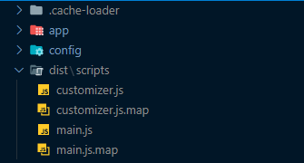
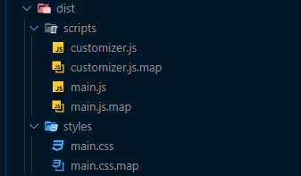
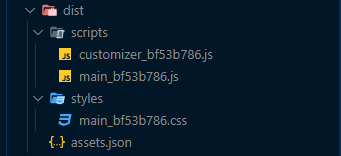

# Instalação e Comandos

## Tecnologias

* Aproveite o poder do [Laravel](https://laravel.com) e seus pacotes disponíveis graças ao [Acorn](https://github.com/roots/acorn).
* Modelagem de temas limpa e eficiente utilizando [Laravel Blade](https://laravel.com/docs/master/blade).
* Suporte para [Browsersync](http://www.browsersync.io) junto com compilação, concatenação e minificação de ativos com o [Laravel Mix](https://github.com/JeffreyWay/laravel-mix).
* Suporte imediato para [TailwindCSS](https://tailwindcss.com) e [jQuery](https://jquery.com).
* Um ponto de partida limpo para estilos de tema usando [Sass](https://sass-lang.com).

## Requerimentos

Certifique-se de que todas as dependências foram instaladas antes de prosseguir:

* [WordPress](https://wordpress.org/) &gt;= 5.4
* [PHP](https://secure.php.net/manual/en/install.php) &gt;= 7.3.0 \(with [`php-mbstring`](https://secure.php.net/manual/en/book.mbstring.php) enabled\)
* [Node.js](http://nodejs.org/) &gt;= 12.14.0
* [Yarn](https://yarnpkg.com/en/docs/install)

## Começando um novo projeto

Para comerçarmos precisamos baixar a última versão do tema inicial com o [**git**](https://git-scm.com), neste [**repositório**](https://github.com/lucasuxui/zeus).


```
$ git clone https://github.com/lucasuxui/zeus.git
```



 O Projeto é público, então não será necessária a utilização de chaves [ssh](https://docs.github.com/en/github/authenticating-to-github/connecting-to-github-with-ssh) ou semelhantes.


## Instalação de Dependências

* Execute o comando `yarn` do diretório do tema para instalar dependências
* Atualize em `resources/assets/config.json` as configurações:
  * `devUrl` deve refletir seu nome de host de desenvolvimento local
  * `publicPath` deve refletir sua estrutura de pastas do WordPress, o que geralmente se inicia por `/wp-content/themes/nome-do-tema`

## Comandos do projeto

* `yarn start` 
  * Compila os arquivos quando forem feitas alterações e inicia a sessão do Browsersync
* `yarn build`
  * Compila e otimiza os arquivos em seu diretório de ativos
* `yarn build:production` 
  * Compila arquivos para produção

Mais detalhes de cada comando abaixo:



```text
$ yarn start
```

Este comando cria as pastas `dist` e `.cache-loader` que são responsáveis pelo _**output**_ do que veremos na nossa aplicação, estes são, resultantes da pasta `assets` **arquivos compilados** .


Neste comando não é gerado arquivo em `.css` pois este já é compilado e injetado no cache de seu browser.






```text
$ yarn build
```

Este comando cria uma nova pasta `dist` , removendo a antiga no comando anterior, mas agora com todo o código compilado/minificado pronto para uso.





```text
$ yarn build:production
```

Este comando faz o mesmo processo do anterior, mas com umas mudanças, gerando um arquivo único com um código bem mais minificado possível.


`assets.json`é o arquivo que aponta os respectivos ids únicos dos arquivos para os arquivos originais.







